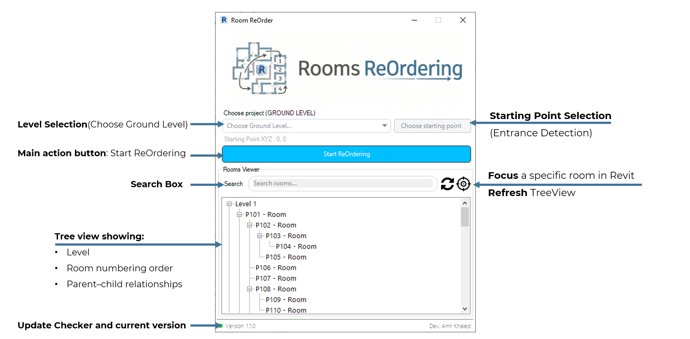

# Rooms ReOrder – Revit Add-in

A smart Revit add-in that automatically renumbers rooms based on **real spatial circulation logic**, not simple geometric sorting.

---

## 🔍 Overview

**Rooms ReOrder** is designed to generate natural, human-like room numbering sequences by understanding how people actually move through a building.

Instead of relying on X/Y coordinates or bounding boxes, the add-in analyzes **door connectivity**, **room relationships**, and **entrance hierarchy** to produce logical and readable room numbers ideal for architectural documentation and large-scale projects.

---

## 🧠 Why Rooms ReOrder?

| Aspect | Common Renumbering Tools | Rooms ReOrder Add-in |
|------|--------------------------|----------------------|
| Sorting logic | Based on geometry (X / Y position) | Based on real circulation flow |
| Entrance handling | No entrance awareness | Starts from the main entrance |
| Room sequence | Breaks across corridors and floors | Maintains logical spatial order |
| Connectivity | Ignores door connections | Uses door-based room connectivity |
| Result | Machine-like numbering | Human-like room progression |

---

## ✨ Features

- Smart **flow-based room numbering**
- Intelligent **main entrance / lobby detection**
- Automatic **start point detection**
- **Door-based connectivity analysis**
- Visual **hierarchy tree view** of room flow
- **Orphan room detection** (disconnected rooms)
- Interactive review before applying numbering

---

## 🧩 Supported Revit Versions

- Revit 2022  
- Revit 2023  
- Revit 2024  
- Revit 2025  
- Revit 2026  

---

## ⚙️ Installation

1. Run **Rooms ReOrder Add-in Setup**.
2. The installer automatically copies:
   - `.dll`
   - `.addin`
   files to the correct Revit Add-ins folders.
3. Launch Revit.
4. The **Rooms ReOrder** button will appear under the **Architecture** panel.

To uninstall, use Windows **Apps & Features**.

---

## 🧪 How to Use

1. Open a Revit project.
2. Click **Rooms ReOrder** from the ribbon.
3. Pick a point near the **main entrance**.
4. Select the **ground level**.
5. Apply numbering.
6. Review the generated room hierarchy.

---

## 🔄 Updates & Version Check

Rooms ReOrder includes a built-in update detection system.

- The add-in automatically checks if a newer version is available.
- When an update is found, a notification appears inside the UI.
- Click the update message to open the download page.
- Download and install the new version to stay up to date.

This ensures you are always using the latest and most stable version of the add-in.

---

## ⚠️ Notes & Limitations

- Works only with **Rooms** category
- Rooms must be connected by **doors**
- Orphan (disconnected) rooms are detected and reported
- No geometry is modified
- Safe to use in production models

---

## 🏗 Ideal Use Cases

- Large residential projects
- Hospitals and educational buildings
- Hotels and mixed-use developments
- Any project where room numbering must follow circulation logic

---

## 👤 Author

**Amr Khaled**  
Computational Architect  

- LinkedIn: https://www.linkedin.com/in/amrkhaled2/  
- Email: mero.mero203512@gmail.com  

---

## 📄 License

Released for educational and professional use.  
Contributions and feedback are welcome.
